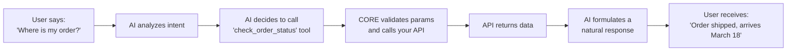
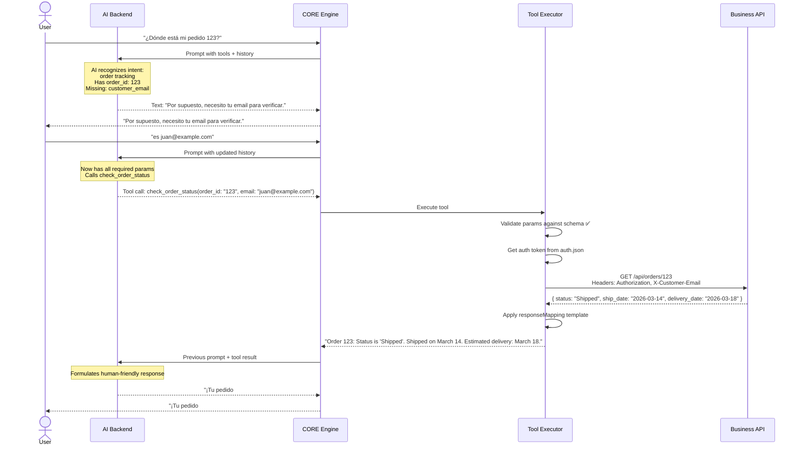

# Guide: API Integration

Connecting the chatbot to your business logic is what makes it useful — it transforms the AI from a text generator into an assistant that can **do things**: check orders, create tickets, look up inventory, process returns.

This guide covers everything you need to integrate business APIs with the chatbot.

---

## 1. How It Works: The Tool System

The AI doesn't call your APIs directly. Instead, you define **tools** — declarative descriptions of what each API endpoint does. The AI reads these descriptions and decides when to use each tool during a conversation.



**You define the tools. The AI decides when and how to use them.**

---

## 2. Defining Tools (`tools.json`)

Each tool is a JSON object describing an API endpoint that the AI can call.

### 2.1 Basic Tool Structure

```json
{
  "tools": [
    {
      "name": "check_order_status",
      "description": "Check the current shipping status and estimated delivery date for a customer order. Use this when a customer asks about their order, delivery, or tracking.",
      "parameters": {
        "type": "object",
        "properties": {
          "order_id": {
            "type": "string",
            "description": "The order number (e.g., ORD-1234 or just 1234)"
          },
          "customer_email": {
            "type": "string",
            "format": "email",
            "description": "Customer's email address for identity verification"
          }
        },
        "required": ["order_id"]
      },
      "endpoint": {
        "method": "GET",
        "url": "{{apiBaseUrl}}/orders/{{order_id}}",
        "headers": {
          "X-Customer-Email": "{{customer_email}}"
        }
      },
      "responseMapping": {
        "template": "Order {{order_id}}: Status is '{{status}}'. {{#if ship_date}}Shipped on {{ship_date}}.{{/if}} {{#if delivery_date}}Estimated delivery: {{delivery_date}}.{{/if}}"
      }
    }
  ]
}
```

### 2.2 Tool Definition Fields

| Field | Required | Description |
|:---|:---|:---|
| `name` | ✅ | Unique identifier. Use `snake_case`. The AI uses this to call the tool. |
| `description` | ✅ | **Critical**. This is what the AI reads to decide when to use the tool. Be specific. Include examples of when to use it. |
| `parameters` | ✅ | JSON Schema defining what data the tool needs. Include `description` for each parameter — the AI uses this to ask the user. |
| `parameters.required` | ✅ | Array of required parameters. The AI will ask for these before calling the tool. |
| `endpoint.method` | ✅ | HTTP method: `GET`, `POST`, `PUT`, `DELETE`, `PATCH` |
| `endpoint.url` | ✅ | URL template. Use `{{paramName}}` for path parameters. |
| `endpoint.headers` | ❌ | Custom headers. Can use `{{paramName}}` for dynamic values. |
| `endpoint.body` | ❌ | Request body template for POST/PUT requests. |
| `responseMapping` | ❌ | How to format the API response for the AI. If omitted, the raw JSON is passed. |

### 2.3 Writing Good Tool Descriptions

The `description` field is the most important part. It's the AI's only guide for deciding when to use the tool.

**❌ Bad description:**
```json
"description": "Gets order info"
```

**✅ Good description:**
```json
"description": "Check the current shipping status and estimated delivery date for a customer order. Use this tool when a customer asks about: where their order is, when it will arrive, tracking information, or delivery updates. Requires the order number (which the customer provides, usually starts with ORD-). Optionally requires customer email for verification."
```

**Tips:**
- Describe the purpose AND the conditions for use
- List common phrases/intents that should trigger this tool
- Describe what each parameter is and where it comes from
- Mention any constraints or limitations

### 2.4 Complete Examples

#### E-commerce Tools

```json
{
  "tools": [
    {
      "name": "search_products",
      "description": "Search the product catalog by name, category, or features. Use when a customer is looking for a product, asks what's available, or wants recommendations. Returns a list of matching products with names, prices, and availability.",
      "parameters": {
        "type": "object",
        "properties": {
          "query": {
            "type": "string",
            "description": "Search term (product name, category, or feature)"
          },
          "category": {
            "type": "string",
            "enum": ["electronics", "clothing", "home", "sports"],
            "description": "Optional: filter by product category"
          },
          "max_price": {
            "type": "number",
            "description": "Optional: maximum price filter"
          },
          "in_stock_only": {
            "type": "boolean",
            "description": "If true, only return products that are currently in stock",
            "default": true
          }
        },
        "required": ["query"]
      },
      "endpoint": {
        "method": "GET",
        "url": "{{apiBaseUrl}}/products/search",
        "queryParams": {
          "q": "{{query}}",
          "category": "{{category}}",
          "maxPrice": "{{max_price}}",
          "inStock": "{{in_stock_only}}"
        }
      },
      "responseMapping": {
        "template": "Found {{results.length}} products:\n{{#each results}}- {{name}} (${{price}}) - {{#if in_stock}}In Stock{{else}}Out of Stock{{/if}}\n{{/each}}"
      }
    },
    {
      "name": "create_order",
      "description": "Create a new order for a customer. Use this ONLY after the customer has confirmed: which product(s) they want, their full name, shipping address, and contact phone number. Do NOT call this tool until all required information has been collected and confirmed by the customer.",
      "parameters": {
        "type": "object",
        "properties": {
          "product_ids": {
            "type": "array",
            "items": { "type": "string" },
            "description": "Array of product IDs to order"
          },
          "customer_name": {
            "type": "string",
            "description": "Customer's full name"
          },
          "shipping_address": {
            "type": "string",
            "description": "Complete shipping address"
          },
          "phone": {
            "type": "string",
            "description": "Contact phone number"
          },
          "notes": {
            "type": "string",
            "description": "Optional order notes"
          }
        },
        "required": ["product_ids", "customer_name", "shipping_address", "phone"]
      },
      "endpoint": {
        "method": "POST",
        "url": "{{apiBaseUrl}}/orders",
        "body": {
          "items": "{{product_ids}}",
          "customer": {
            "name": "{{customer_name}}",
            "address": "{{shipping_address}}",
            "phone": "{{phone}}"
          },
          "notes": "{{notes}}"
        }
      },
      "responseMapping": {
        "template": "Order created successfully! Order number: {{order_id}}. Payment link: {{payment_url}}"
      }
    },
    {
      "name": "request_return",
      "description": "Initiate a return/refund request for an existing order. Use when a customer wants to return a product or request a refund. Requires the order number and reason for return. Before calling, verify the order is within the return window (30 days) based on business rules.",
      "parameters": {
        "type": "object",
        "properties": {
          "order_id": {
            "type": "string",
            "description": "The order number to return"
          },
          "reason": {
            "type": "string",
            "enum": ["defective", "wrong_item", "not_as_described", "changed_mind", "other"],
            "description": "Reason for the return"
          },
          "description": {
            "type": "string",
            "description": "Detailed description of the issue"
          }
        },
        "required": ["order_id", "reason"]
      },
      "endpoint": {
        "method": "POST",
        "url": "{{apiBaseUrl}}/orders/{{order_id}}/returns",
        "body": {
          "reason": "{{reason}}",
          "description": "{{description}}"
        }
      }
    }
  ]
}
```

#### Support / Ticketing Tools

```json
{
  "tools": [
    {
      "name": "create_support_ticket",
      "description": "Create a new support ticket for issues that the AI cannot resolve automatically. Use when: the issue requires human intervention, the customer is frustrated and wants to speak to a person, or the problem is outside the scope of available tools. Collect the customer's name, email, and a detailed description of the issue before creating the ticket.",
      "parameters": {
        "type": "object",
        "properties": {
          "customer_name": { "type": "string" },
          "customer_email": { "type": "string", "format": "email" },
          "subject": { "type": "string", "description": "Brief summary of the issue" },
          "description": { "type": "string", "description": "Detailed description including any troubleshooting already attempted" },
          "priority": {
            "type": "string",
            "enum": ["low", "medium", "high", "urgent"],
            "description": "Priority based on impact: urgent = service completely down, high = major feature broken, medium = minor issue, low = question/enhancement"
          }
        },
        "required": ["customer_email", "subject", "description", "priority"]
      },
      "endpoint": {
        "method": "POST",
        "url": "{{apiBaseUrl}}/tickets",
        "body": {
          "reporter": { "name": "{{customer_name}}", "email": "{{customer_email}}" },
          "subject": "{{subject}}",
          "body": "{{description}}",
          "priority": "{{priority}}",
          "source": "ai-chatbot"
        }
      }
    },
    {
      "name": "check_service_status",
      "description": "Check if there are any known outages or service disruptions in a specific area or for a specific service. Use when a customer reports that something isn't working.",
      "parameters": {
        "type": "object",
        "properties": {
          "service_type": {
            "type": "string",
            "enum": ["internet", "cable_tv", "phone", "all"],
            "description": "Type of service to check"
          },
          "zip_code": {
            "type": "string",
            "description": "Customer's ZIP/postal code"
          }
        },
        "required": ["service_type"]
      },
      "endpoint": {
        "method": "GET",
        "url": "{{apiBaseUrl}}/service-status",
        "queryParams": {
          "service": "{{service_type}}",
          "zip": "{{zip_code}}"
        }
      }
    }
  ]
}
```

---

## 3. Authentication (`auth.json`)

Configure how the library authenticates with your business APIs.

### 3.1 API Key Authentication

```json
{
  "auth": {
    "type": "api_key",
    "headerName": "X-API-Key",
    "key": "${BUSINESS_API_KEY}"
  }
}
```

### 3.2 Bearer Token (Static)

```json
{
  "auth": {
    "type": "bearer",
    "token": "${BUSINESS_API_TOKEN}"
  }
}
```

### 3.3 JWT with Auto-Refresh

```json
{
  "auth": {
    "type": "jwt",
    "tokenEndpoint": "https://api.example.com/oauth/token",
    "clientId": "${OAUTH_CLIENT_ID}",
    "clientSecret": "${OAUTH_CLIENT_SECRET}",
    "grantType": "client_credentials",
    "scope": "chatbot:read chatbot:write",
    "tokenRefreshBufferSeconds": 60
  }
}
```

The library automatically:
1. Requests a new token on first API call
2. Caches the token until expiry
3. Refreshes the token 60 seconds before it expires
4. Retries failed requests with a fresh token (in case of early expiry)

### 3.4 Custom Headers

```json
{
  "auth": {
    "type": "custom",
    "headers": {
      "X-API-Key": "${API_KEY}",
      "X-Tenant-ID": "${TENANT_ID}",
      "X-Source": "chatbot-ia-lib"
    }
  }
}
```

> **Security**: All values starting with `${}` are read from environment variables. Never hardcode secrets in `auth.json`.

---

## 4. Data Flow: Complete Example

Here's a complete trace of how a user message becomes an API call and back:

### Scenario: "¿Dónde está mi pedido 123?"



---

## 5. Response Mapping

Control what the AI sees from your API response.

### 5.1 Template Mapping
Format the response using Handlebars templates:
```json
{
  "responseMapping": {
    "template": "Order {{order_id}} is currently {{status}}. {{#if delivery_date}}Expected delivery: {{delivery_date}}.{{else}}No delivery date available yet.{{/if}}"
  }
}
```

### 5.2 Field Selection
Only pass specific fields (hide internal IDs, sensitive data):
```json
{
  "responseMapping": {
    "fields": ["status", "delivery_date", "carrier_name"],
    "exclude": ["internal_id", "warehouse_code", "cost_price"]
  }
}
```

### 5.3 No Mapping (Pass-Through)
If `responseMapping` is omitted, the full JSON response is passed to the AI. This works but may:
- Expose internal fields you don't want the AI to mention
- Waste tokens on irrelevant data
- Risk the AI surfacing sensitive information

---

## 6. Error Handling

The Tool Executor handles errors gracefully so the conversation continues even when APIs fail.

| Error Type | What Happens | AI Receives |
|:---|:---|:---|
| **Validation fails** | Parameters don't match schema | `"Error: Missing required parameter 'order_id'. Please ask the customer for the order number."` |
| **Auth failure (401/403)** | Token expired or invalid | `"Error: Unable to authenticate with the business API. Please escalate to a human agent."` |
| **Not found (404)** | Resource doesn't exist | `"Error: Order '999' was not found in the system. Please verify the order number with the customer."` |
| **Server error (5xx)** | External API is down | `"Error: The order system is temporarily unavailable. Please try again in a few minutes."` |
| **Timeout** | API didn't respond | `"Error: The request timed out. The system may be experiencing high load."` |
| **Rate limit (429)** | Too many requests | `"Error: Rate limit exceeded. Please wait a moment before trying again."` |

The AI receives these errors as tool results and formulates a human-friendly response for the user.

---

## 7. Security Best Practices

### API Side (Your Server)

1. **Dedicated chatbot credentials**: Create API keys specifically for the chatbot with minimal required permissions (read-only where possible)
2. **Rate limiting**: Implement rate limits per API key to prevent abuse
3. **Input validation**: Never trust AI-generated parameters — validate all inputs server-side
4. **Audit logging**: Log all API calls from the chatbot for monitoring

### Chatbot Side (This Library)

1. **Secret management**: Use environment variables (`${VARIABLE}`) for all secrets
2. **Parameter validation**: All AI-generated parameters are validated against JSON Schema before any API call
3. **Response filtering**: Use `responseMapping` to exclude sensitive fields (internal IDs, cost prices, customer SSNs)
4. **Proxy pattern**: Consider placing a middleware/proxy between the chatbot and sensitive APIs for additional sanitization
5. **Never expose DB IDs**: Map internal database IDs to user-facing identifiers in your API

### Example `.env` file

```env
# AI Backend
OLLAMA_BASE_URL=http://localhost:11434
DEEPSEEK_API_KEY=sk-xxxxxxxxxxxxx

# Business API
API_BASE_URL=https://api.your-business.com/v1
BUSINESS_API_KEY=your-api-key-here
OAUTH_CLIENT_ID=chatbot-client
OAUTH_CLIENT_SECRET=your-secret-here

# Security
SESSION_SECRET=random-32-char-string
RATE_LIMIT_PER_MINUTE=20
```

---

## 8. Testing Your Integration

Before going live, test every tool:

```bash
# Run the built-in tool test suite
chatbot-ia-lib validate --tools

# Test a specific tool
chatbot-ia-lib validate --tool check_order_status --params '{"order_id": "ORD-123"}'

# Interactive testing (chat with the bot and watch tool calls in real-time)
chatbot-ia-lib start --debug
```

The `--debug` mode shows:
- Every prompt sent to the AI
- Tool call decisions (name, parameters)
- Raw API requests and responses
- Final formatted response
