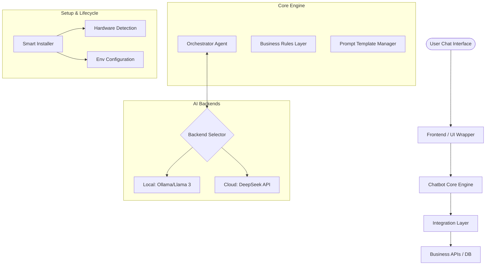

# Architecture: Generic Ecommerce Chatbot Library

## High-Level Architecture

The library is designed for modularity and separation of concerns.

## Component Description

### 1. Smart Installer
-   Handles initial setup.
-   Detects available resources (VRAM, RAM, CPU).
-   Sets up the local LLM runtime if needed.

### 2. Chatbot Core Engine
-   **Orchestrator**: The main logic that manages conversation history, context, and intent.
-   **Business Rules Layer**: Translates business requirements into system prompts or instructions for the AI.
-   **Prompt Manager**: Stores and optimizes templates for different use cases (e.g., support vs. sales).

### 3. Integration Layer
-   Abstracts the communication with external services.
-   Handles authentication and data formatting for business APIs.
-   Provides "hooks" for developers to inject custom logic.

### 4. AI Backend Selector
-   Routes requests to the chosen provider (Local or Cloud).
-   Handles fallback logic if one provider is unavailable.

## Data Flow
1.  **User Message** arrives at the UI.
2.  **Core Engine** retrieves conversation context.
3.  **Core** combines context + business rules + user message into a prompt.
4.  **Backend Selector** sends the prompt to the LLM.
5.  **LLM** responds with a completion (or an action if function calling is used).
6.  **Integration Layer** executes any necessary API calls (e.g., checking order status).
7.  **Core** formats the final response for the **User**.
