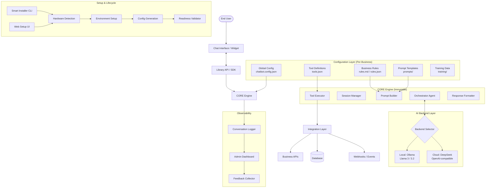
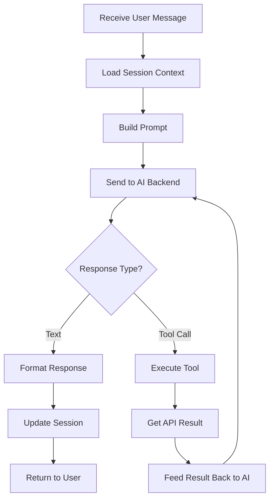
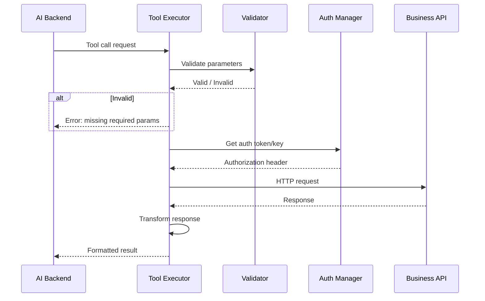
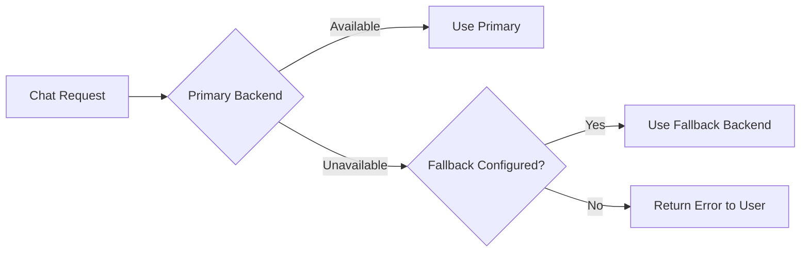
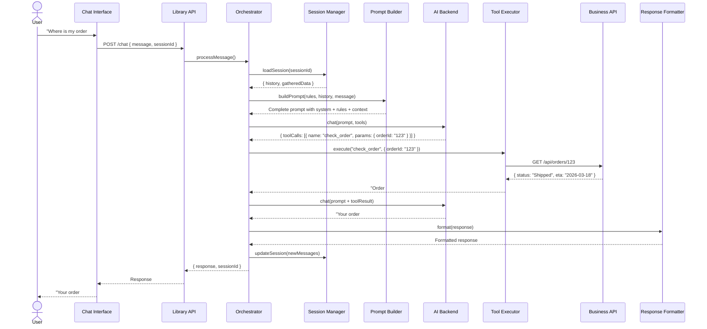

# Architecture: Generic AI Chatbot Library (chatbot-ia-lib)

## Design Principles

1. **Separation of Concerns**: The CORE engine is fully independent from business logic. Business-specific behavior is defined entirely through configuration files.
2. **Provider Agnosticism**: The AI backend (local or cloud) is abstracted behind a unified interface. Switching providers requires zero code changes.
3. **Plugin-Based Integration**: External API connections are defined declaratively. The CORE invokes them based on AI decisions, not hardcoded flow.
4. **Stateless Core, Stateful Sessions**: The engine itself is stateless. Session state (conversation history, gathered data) is managed per user via a session store.

---

## High-Level Architecture



---

## Component Details

### 1. Unified Installer (`installer/`)

The entry point for new installations. Offers two modes:
- **Interactive CLI**: For fast, keyboard-driven setup.
- **Web Setup UI**: A local-run web interface for an even more intuitive, guided experience.

**Responsibilities:**
- Detect system hardware (CPU features, GPU type & VRAM, RAM, disk space)
- Recommend the optimal AI model based on a decision matrix
- Install/configure the chosen AI backend (Ollama download, model pull, or cloud API key setup)
- Generate starter configuration files with documented examples
- Validate the environment is ready (dependencies, connectivity, model responsiveness)
- Provide a `chatbot-ia-lib doctor` command for ongoing diagnostics

**Key Files:**
```
installer/
├── cli/                  # CLI implementation (Commander.js)
├── web-ui/               # Web-based setup interface (Express + Vanilla JS)
├── shared/               # Core installer logic used by both CLI and Web
│   ├── hardware-detector.js
│   ├── model-recommender.js
│   ├── ollama-setup.js
│   ├── cloud-setup.js
│   ├── config-generator.js
│   └── validator.js
└── index.js              # Launcher dispatching to CLI or Web
```

**Interface Contract:**
```typescript
interface InstallerResult {
  backend: 'ollama' | 'cloud';
  model: string;             // e.g., 'llama3.2:8b-q4_K_M'
  configPath: string;        // path to generated config
  hardwareProfile: {
    cpu: { cores: number; avx2: boolean };
    gpu: { type: 'cuda' | 'metal' | 'rocm' | 'none'; vram: number };
    ram: number;
    disk: number;
  };
}
```

---

### 2. CORE Engine (`core/`)

The immutable brain of the chatbot. This code is the same for every deployment.

#### 2.1 Orchestrator Agent (`core/orchestrator.js`)

The main control loop that processes each user message.

**Flow:**


**Responsibilities:**
- Maintains the conversation loop (message → AI → response/action → repeat)
- Manages the multi-turn context window (keeping only relevant history)
- Detects when the AI wants to call a tool vs. respond with text
- Handles tool call chains (AI calls tool → gets result → decides to call another tool or respond)
- Enforces maximum loop iterations to prevent infinite tool-calling loops
- Applies response post-processing (formatting, sanitization)

**Configuration Points:**
```json
{
  "orchestrator": {
    "maxToolCallsPerTurn": 5,
    "contextWindowTokens": 4096,
    "contextStrategy": "sliding_window",
    "timeoutMs": 30000,
    "retryOnError": true,
    "maxRetries": 2
  }
}
```

#### 2.2 Session Manager (`core/session-manager.js`)

Manages per-user conversation state.

**Responsibilities:**
- Create, load, save, and expire sessions
- Store conversation history with token counting
- Track gathered user data (name, email, order ID, etc.) within a session
- Implement context window strategies (sliding window, summarization, priority-based)
- Handle concurrent sessions from the same user

**Session Data Structure:**
```typescript
interface Session {
  id: string;
  userId: string;
  createdAt: Date;
  lastActivityAt: Date;
  conversationHistory: Message[];
  gatheredData: Record<string, any>;  // { email: "...", orderId: "..." }
  metadata: {
    tokensUsed: number;
    toolCallsTotal: number;
    escalated: boolean;
  };
}

interface Message {
  role: 'user' | 'assistant' | 'system' | 'tool';
  content: string;
  timestamp: Date;
  toolCalls?: ToolCall[];
  toolResult?: any;
}
```

**Storage Backends:**
- **In-Memory** (default for development): Fast, lost on restart
- **SQLite** (default for production): Persistent, single-server
- **Redis** (optional): For multi-server deployments with shared sessions

#### 2.3 Prompt Builder (`core/prompt-builder.js`)

Assembles the complete prompt sent to the AI on every turn.

**Prompt Assembly Order:**
```
┌──────────────────────────────────────────────┐
│  1. BASE SYSTEM PROMPT (from template)       │
│     "You are a helpful assistant for..."     │
├──────────────────────────────────────────────┤
│  2. BUSINESS RULES INJECTION                 │
│     Content from rules.md / rules.json       │
├──────────────────────────────────────────────┤
│  3. AVAILABLE TOOLS SUMMARY                  │
│     Auto-generated from tools.json           │
├──────────────────────────────────────────────┤
│  4. SESSION CONTEXT                          │
│     Previously gathered data, active task    │
├──────────────────────────────────────────────┤
│  5. CONVERSATION HISTORY                     │
│     Last N messages (within token budget)    │
├──────────────────────────────────────────────┤
│  6. CURRENT USER MESSAGE                     │
│     The latest user input                    │
└──────────────────────────────────────────────┘
```

**Template Variables:**
```markdown
# System Prompt Template
You are {{botName}}, a virtual assistant for {{companyName}}.

## Your Role
{{roleDescription}}

## Rules You MUST Follow
{{businessRules}}

## Available Actions
You can perform the following actions when needed:
{{toolDescriptions}}

## Current Session Info
{{#if gatheredData}}
Information already collected in this conversation:
{{gatheredData}}
{{/if}}
```

#### 2.4 Tool Executor (`core/tool-executor.js`)

Executes external API calls as directed by the AI.

**Responsibilities:**
- Parse tool call requests from AI responses (supports OpenAI function-calling format)
- Validate parameters against tool schemas before execution
- Execute HTTP calls to business APIs with proper authentication
- Handle errors gracefully (timeout, auth failure, invalid response)
- Transform API responses into AI-readable summaries
- Log all tool executions for auditing

**Execution Flow:**


#### 2.5 Response Formatter (`core/response-formatter.js`)

Post-processes AI responses before sending to the user.

**Responsibilities:**
- Remove internal reasoning/chain-of-thought markers
- Apply markdown/HTML formatting based on output channel (web, API, WhatsApp)
- Detect and format special content (links, product cards, images)
- Enforce response length limits
- Apply profanity/content filters if configured
- Insert dynamic elements (buttons, quick replies) for supported interfaces

---

### 3. Configuration Layer (`config/`)

All business-specific behavior is defined through these files. **The CORE never changes — only the config does.**

```
config/
├── chatbot.config.json     # Main configuration file
├── rules.md                # Business rules in natural language
├── prompts/
│   ├── system.md           # Main system prompt template
│   ├── welcome.md          # First message template
│   ├── escalation.md       # Escalation prompt
│   └── fallback.md         # When AI can't help
├── tools.json              # API tool definitions
├── auth.json               # API authentication config
└── training/
    ├── faq.jsonl            # Question/answer pairs for fine-tuning
    └── corrections.jsonl    # Corrected responses for retraining
```

> See [CONFIGURATION_GUIDE.md](CONFIGURATION_GUIDE.md) for complete file format documentation.

---

### 4. AI Backend Layer (`backends/`)

Abstracted interface for communicating with LLMs.

**Interface:**
```typescript
interface AIBackend {
  name: string;
  
  // Send a prompt and get a completion  
  chat(messages: Message[], tools?: ToolDefinition[]): Promise<AIResponse>;

  // Check if the backend is available and responsive
  healthCheck(): Promise<boolean>;
  
  // Get model information (context window, capabilities)
  getModelInfo(): Promise<ModelInfo>;
}

interface AIResponse {
  content: string | null;
  toolCalls: ToolCall[] | null;
  usage: { promptTokens: number; completionTokens: number };
  finishReason: 'stop' | 'tool_calls' | 'length';
}
```

**Supported Backends:**

| Backend | Engine | How It Works |
|:---|:---|:---|
| `OllamaBackend` | Local | Communicates with Ollama's REST API (`localhost:11434`) |
| `CloudBackend` | Remote | OpenAI-compatible API calls (DeepSeek, GPT, etc.) |

**Fallback Logic:**


Configuration:
```json
{
  "ai": {
    "primary": {
      "type": "ollama",
      "model": "llama3.2:8b",
      "baseUrl": "http://localhost:11434"
    },
    "fallback": {
      "type": "cloud",
      "model": "deepseek-chat",
      "apiKey": "${DEEPSEEK_API_KEY}"
    }
  }
}
```

---

### 5. Integration Layer (`integrations/`)

Connects the chatbot to external business systems.

**Responsibilities:**
- Execute authenticated HTTP requests to business APIs
- Handle token refresh for OAuth/JWT flows
- Transform request/response data between AI format and API format
- Implement retry logic with exponential backoff
- Circuit breaker pattern for failing APIs
- Rate limiting to protect business APIs

**Data Transformation Pipeline:**
```
AI Tool Call Parameters
    ↓ (validate against schema)
Validated Parameters
    ↓ (apply request mapping)
API Request Body
    ↓ (HTTP call with auth)
Raw API Response
    ↓ (apply response mapping)
AI-Readable Summary
```

---

### 6. Observability (`observability/`)

Tools for monitoring, debugging, and improving the chatbot over time.

**Components:**
- **Conversation Logger**: Records all conversations with metadata (duration, tool calls, resolution status)
- **Admin Dashboard**: Web interface to browse conversations, view analytics, and manage configurations
- **Feedback Collector**: Allows users (or admins) to rate AI responses as correct/incorrect
- **Analytics Engine**: Tracks metrics like resolution rate, average conversation length, most common intents, escalation rate

---

## Data Flow: Complete Request Lifecycle



---

## Directory Structure (Planned)

```
chatbot-ia-lib/
├── README.md
├── package.json
├── bin/
│   └── cli.js                    # npx chatbot-ia-lib [command]
├── installer/
│   ├── index.js                  # Entry point (npx chatbot-ia-lib init)
│   ├── cli/                      # CLI-specific logic
│   ├── web-ui/                   # Web interface files (bundled)
│   └── shared/                   # Logic shared by CLI and Web
│       ├── hardware-detector.js
│       ├── model-recommender.js
│       ├── ollama-setup.js
│       ├── cloud-setup.js
│       ├── config-generator.js
│       └── validator.js
├── core/
│   ├── orchestrator.js
│   ├── session-manager.js
│   ├── prompt-builder.js
│   ├── tool-executor.js
│   └── response-formatter.js
├── backends/
│   ├── backend-interface.js
│   ├── ollama-backend.js
│   └── cloud-backend.js
├── integrations/
│   ├── http-client.js
│   ├── auth-manager.js
│   └── data-transformer.js
├── observability/
│   ├── logger.js
│   ├── analytics.js
│   └── dashboard/               # Admin UI (optional)
├── config/                      # Generated per-project
│   ├── chatbot.config.json
│   ├── rules.md
│   ├── prompts/
│   ├── tools.json
│   ├── auth.json
│   └── training/
├── templates/                   # Starter templates
│   ├── ecommerce/
│   ├── support/
│   └── general/
├── tests/
│   ├── unit/
│   ├── integration/
│   └── e2e/
└── docs/
    ├── CONCEPT.md
    ├── ARCHITECTURE.md
    ├── REQUIREMENTS.md
    ├── INSTALLER_SPEC.md
    ├── API_INTEGRATION_GUIDE.md
    ├── TRAINING_AND_FINETUNING.md
    ├── CONFIGURATION_GUIDE.md
    ├── CORE_VS_CONFIG.md
    ├── PROJECT_ANALYSIS.md
    └── GLOSSARY.md
```

---

## Technology Stack

| Layer | Technology | Rationale |
|:---|:---|:---|
| **Runtime** | Node.js (v18+) | Widespread adoption, async-friendly, npm ecosystem |
| **AI Communication** | Ollama REST API, OpenAI-compatible SDK | Standard interfaces, minimal custom code |
| **Session Storage** | SQLite (better-sqlite3) | Zero-config, lightweight, single-file DB |
| **HTTP Client** | Axios | Robust HTTP client with interceptors for auth/retry |
| **CLI** | Commander.js | Standard Node.js CLI framework |
| **Template Engine** | Handlebars | For prompt templates with logic (if/each/helpers) |
| **Testing** | Vitest | Fast, modern, compatible with ESM |
| **Admin & Installer UI** | Express + Vanilla HTML/CSS/JS | Lightweight, no framework dependency for the library itself |
