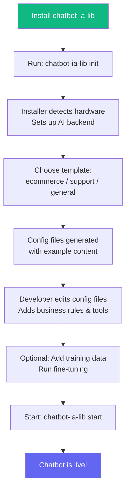

# CORE vs Configuration: The Architecture Philosophy

This document explains the fundamental design decision behind `chatbot-ia-lib`: **separating what never changes (CORE) from what changes per business (Configuration).**

---

## The Problem

When building chatbots for multiple clients or businesses, the traditional approach leads to one of two anti-patterns:

### Anti-Pattern 1: Fork-per-Client
```
chatbot-clientA/     ← Full copy of the codebase
chatbot-clientB/     ← Another full copy, diverging over time
chatbot-clientC/     ← And another...
```
**Problems**: Bug fixes must be applied to every fork. Features diverge. Maintenance is a nightmare.

### Anti-Pattern 2: Spaghetti Conditionals
```javascript
if (client === 'ClientA') {
  // ClientA-specific logic
} else if (client === 'ClientB') {
  // ClientB-specific logic
} else {
  // Default logic
}
```
**Problems**: Core code becomes unreadable. Every new client adds complexity. High risk of regression.

---

## The Solution: CORE + Configuration

```
chatbot-ia-lib/
├── core/          ← IMMUTABLE: Same for every deployment
├── backends/      ← IMMUTABLE: AI provider abstractions
├── integrations/  ← IMMUTABLE: HTTP/auth infrastructure
├── installer/     ← IMMUTABLE: Setup wizard
│
└── config/        ← MUTABLE: Changes per business
    ├── chatbot.config.json
    ├── rules.md
    ├── tools.json
    ├── prompts/
    └── training/
```

### What Goes in CORE (Never Changes)

| Component | Purpose | Why It's Universal |
|:---|:---|:---|
| Orchestrator | Manages the conversation loop | Every chatbot has the same message → AI → response cycle |
| Session Manager | Tracks per-user state | Every chatbot needs session management |
| Prompt Builder | Assembles prompts from templates + rules | The assembly process is the same; only the content varies |
| Tool Executor | Calls APIs when the AI decides to | The mechanism is the same; only the endpoints vary |
| Response Formatter | Post-processes AI output | Formatting rules are configurable, not coded |
| AI Backend Interface | Talks to Ollama/Cloud LLMs | The API protocol is standard |
| Installer | Sets up the environment | Same process, different hardware |

### What Goes in Configuration (Changes Per Business)

| File | Purpose | Changes Because |
|:---|:---|:---|
| `chatbot.config.json` | System settings | Different infrastructure, models, ports |
| `rules.md` | Business policies | Every business has different rules |
| `tools.json` | API integrations | Every business has different APIs |
| `prompts/` | Conversation templates | Different brand voice, language, style |
| `auth.json` | API credentials | Different services, different auth |
| `training/` | Domain knowledge | Different products, terminology, workflows |

---

## How It Works in Practice

### Deploying for a New Business



### Example: Same CORE, Two Businesses

```
Business A: "TechStore" (E-commerce)
├── config/
│   ├── rules.md          → Refund policy, shipping rules, product info
│   ├── tools.json        → search_products, check_order, create_return
│   └── prompts/system.md → "You are TechBot, an electronics store assistant"

Business B: "FastConnect" (ISP Support)  
├── config/
│   ├── rules.md          → Troubleshooting steps, service plans, coverage areas
│   ├── tools.json        → check_service_status, create_ticket, schedule_visit
│   └── prompts/system.md → "You are ConnectBot, an internet service support assistant"

CORE ENGINE → Identical code in both deployments
```

---

## The Boundary Rules

### ✅ CORE Should:
- Handle the conversation lifecycle (receive → process → respond)
- Manage sessions and context windows
- Build prompts from templates + injected content
- Execute tool calls via HTTP
- Communicate with AI backends
- Log and monitor activity
- Validate config files

### ❌ CORE Should NOT:
- Know what business it's serving
- Contain any business-specific logic (no `if client === X`)
- Hardcode API endpoints, policies, or responses
- Reference specific product names, prices, or brands
- Assume a specific industry or use case

### ✅ Configuration Should:
- Define all business-specific behavior
- Describe API endpoints and their parameters
- Set conversation tone and style
- Provide domain knowledge and training data
- Configure infrastructure settings (ports, storage, timeouts)

### ❌ Configuration Should NOT:
- Contain executable code (no JavaScript in JSON files)
- Modify the CORE's behavior through code injection
- Override the CORE's security mechanisms
- Access the file system or run system commands

---

## Versioning & Compatibility

### CORE Versioning
The CORE follows **semantic versioning** (semver):
- **Patch** (1.0.X): Bug fixes. Config files are 100% compatible.
- **Minor** (1.X.0): New features. New config fields may be added (with defaults). Existing configs continue working.
- **Major** (X.0.0): Breaking changes. Config migration guide provided.

### Config Schema Versioning
Config files declare their version:
```json
{
  "version": "1.0",
  ...
}
```

On startup, the CORE checks config version compatibility and warns/errors if there's a mismatch:
```
⚠ Config file version 1.0, but CORE expects 1.2. 
  Missing new fields will use defaults. 
  Run 'chatbot-ia-lib migrate-config' to update.
```

---

## Benefits of This Approach

| Benefit | Description |
|:---|:---|
| **Single codebase** | One CORE, many deployments. Bug fixes benefit everyone. |
| **Fast deployment** | New client = new config, not new code. |
| **No AI knowledge required** | Business analysts can write rules.md in plain language. |
| **Safe updates** | CORE updates don't break business logic (config stays). |
| **Testable** | CORE is tested once. Config is validated per-deployment. |
| **Auditable** | Business rules are visible in plain text files, not buried in code. |
| **Reversible** | Roll back a config change = restore a file. No code deployment needed. |

---

## Comparison with Other Approaches

| Approach | Pros | Cons |
|:---|:---|:---|
| **Fork-per-client** | Full control per client | Unmaintainable at scale |
| **Monolith with conditionals** | Single codebase | Spaghetti code, high risk |
| **Microservices** | Scalable, isolated | Over-engineered for most chatbot use cases |
| **Plugin system** | Extensible | Requires coding for each plugin |
| **CORE + Config (this library)** | Simple, maintainable, no coding per client | Limited to what config can express |

The CORE + Config approach is ideal when:
- Business logic can be expressed declaratively (rules, templates, schemas)
- The interaction pattern is consistent (always a chatbot)
- The customization comes from *content* (what the bot knows) not *behavior* (how the bot works)
