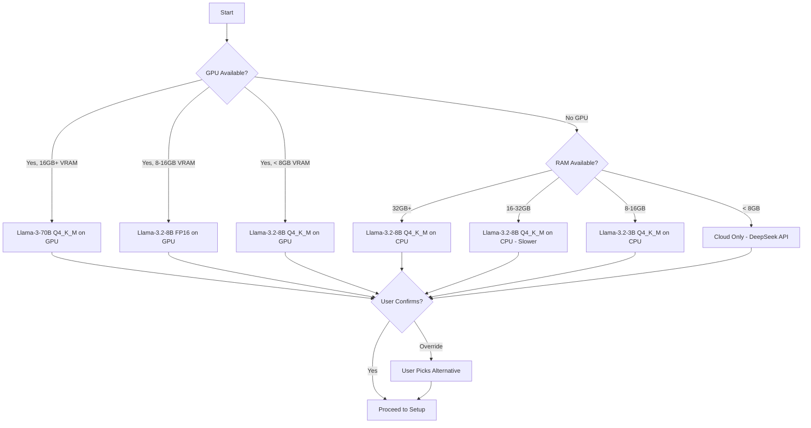
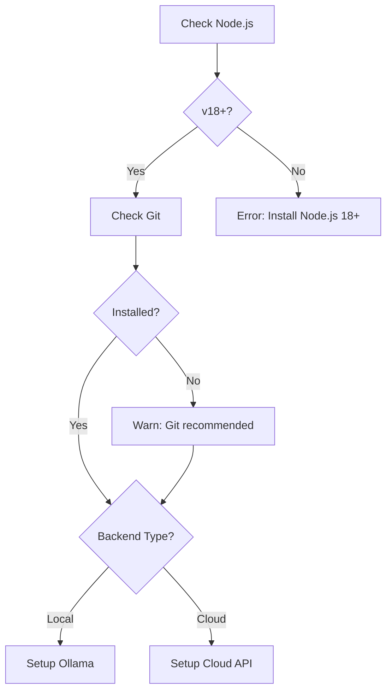

# Specification: Smart Installer

The Installer is the **entry point** of the library. It ensures the system is optimized for the host hardware, configured for the chosen AI backend, and ready to run — all through an interactive CLI.

---

## Overview

```bash
# Full interactive setup
npx chatbot-ia-lib init

# Non-interactive with flags
npx chatbot-ia-lib init --backend ollama --model llama3.2:8b --template ecommerce

# Diagnostics
npx chatbot-ia-lib doctor
```

---

## 1. Environment Analysis

The installer performs a comprehensive system scan before recommending anything.

### 1.1 CPU Detection
| Check | Purpose | How |
|:---|:---|:---|
| Core count | Determine parallelism capacity | `os.cpus().length` |
| AVX/AVX2 support | Required for efficient local inference | Parse `/proc/cpuinfo` (Linux), `sysctl` (macOS), `wmic` (Win) |
| Architecture | ARM64 vs x86_64 | `os.arch()` |

### 1.2 GPU Detection
| Check | Purpose | How |
|:---|:---|:---|
| GPU Presence | Determine if local inference is viable with acceleration | Platform-specific queries |
| GPU Type | CUDA (NVIDIA), Metal (Apple), ROCm (AMD) | `nvidia-smi`, `system_profiler`, `rocm-smi` |
| VRAM | How large a model can fit in GPU memory | Same tools |

**Platform-Specific Detection:**
```
macOS (Apple Silicon):
  system_profiler SPDisplaysDataType → Unified Memory (shared with RAM)
  
macOS (Intel + dGPU):
  system_profiler SPDisplaysDataType → Dedicated VRAM

Linux (NVIDIA):
  nvidia-smi --query-gpu=name,memory.total --format=csv

Linux (AMD):
  rocm-smi --showmeminfo vram

Windows (NVIDIA):
  nvidia-smi (same as Linux)
  
Windows (Generic):
  wmic path win32_VideoController get AdapterRAM,Name
```

### 1.3 RAM Detection
| Check | Purpose |
|:---|:---|
| Total RAM | Determine max model size (especially for CPU-only inference) |
| Available RAM | Ensure enough free RAM to load the model |

### 1.4 Storage Detection
| Check | Purpose |
|:---|:---|
| Available disk space | LLM models range from 2GB (3B Q4) to 40GB+ (70B Q4) |
| Drive type (SSD/HDD) | Affects model loading time |

---

## 2. Decision Matrix

Based on the analysis, the installer recommends a configuration using this priority order:

### 2.1 Model Selection Matrix



### 2.2 Full Decision Table

| RAM | GPU | VRAM | Recommended Model | Quantization | Engine | Expected Speed |
|:---|:---|:---|:---|:---|:---|:---|
| < 8GB | None | - | DeepSeek-V3 (Cloud) | N/A | Cloud API | Depends on network |
| 8-16GB | None | - | Llama-3.2-3B | Q4_K_M | Ollama (CPU) | ~5 tokens/sec |
| 16-32GB | None | - | Llama-3.2-8B | Q4_K_M | Ollama (CPU) | ~3-8 tokens/sec |
| 32GB+ | None | - | Llama-3.2-8B | Q4_K_M | Ollama (CPU) | ~8-15 tokens/sec |
| Any | Apple M1/M2/M3 | Unified | Llama-3.2-8B | Q4_K_M | Ollama (Metal) | ~20-40 tokens/sec |
| Any | NVIDIA | 8GB | Llama-3.2-8B | Q4_K_M | Ollama (CUDA) | ~30-50 tokens/sec |
| Any | NVIDIA | 12-16GB | Llama-3.2-8B | FP16 | Ollama (CUDA) | ~40-60 tokens/sec |
| Any | NVIDIA | 24GB+ | Llama-3-70B | Q4_K_M | Ollama (CUDA) | ~15-25 tokens/sec |
| Server | N/A | N/A | DeepSeek-V3 / GPT-4o | N/A | Cloud API | Depends on network |

### 2.3 User Override

The installer always allows the user to override the recommendation:
```
Detected: Apple M2 Pro, 32GB Unified Memory, 500GB SSD

Recommended configuration:
  Model:  llama3.2:8b (Q4_K_M quantization)
  Engine: Ollama (Metal acceleration)
  Speed:  ~30 tokens/second (estimated)
  Size:   ~4.7GB download

? Accept this recommendation? (Y/n/custom)
  Y - Accept and continue
  n - Use cloud API instead
  custom - Choose a different model manually
```

---

## 3. Setup Automation

### 3.1 Dependency Checks



### 3.2 Ollama Setup (Local Backend)

**Step-by-step:**

1. **Check if Ollama is installed**
   ```bash
   ollama --version
   ```
   If not found → download from https://ollama.ai and install

2. **Start Ollama service**
   ```bash
   ollama serve &
   ```
   Wait for health check at `http://localhost:11434/api/tags`

3. **Pull the recommended model**
   ```bash
   ollama pull llama3.2:8b
   ```
   Show progress bar during download (can be 4-40GB)

4. **Verify model works**
   ```bash
   curl http://localhost:11434/api/chat -d '{
     "model": "llama3.2:8b",
     "messages": [{"role": "user", "content": "Say hello"}],
     "stream": false
   }'
   ```
   Must receive a valid response within 30 seconds

5. **Configure advanced settings** (optional)
   - Number of GPU layers to offload
   - Context window size
   - Thread count for CPU inference

### 3.3 Cloud API Setup

**Step-by-step:**

1. **Select provider**
   ```
   ? Which cloud AI provider?
     ❯ DeepSeek (recommended, cost-effective)
       OpenAI (GPT-4o)
       Custom (OpenAI-compatible API)
   ```

2. **Enter API key**
   ```
   ? Enter your API key: sk-xxxxxxxxxxxxxxxxxxxxx
   ```
   Input is masked (hidden characters)

3. **Validate API key**
   Send a test request and verify:
   - Authentication succeeds
   - The selected model is available
   - Response is valid

4. **Store securely**
   - Save to `.env` file (added to `.gitignore` automatically)
   - Never stored in JSON config files

### 3.4 Configuration File Generation

After backend setup, generate the project's configuration directory:

```
config/
├── chatbot.config.json     ← Main settings (backend, model, server port)
├── rules.md                ← Business rules template with examples
├── prompts/
│   ├── system.md           ← System prompt template
│   ├── welcome.md          ← First message for new sessions
│   ├── escalation.md       ← When to escalate to human
│   └── fallback.md         ← When AI can't help
├── tools.json              ← API tool definitions (empty, with examples commented)
├── auth.json               ← API authentication config (empty, with examples)
└── training/
    └── README.md            ← Instructions for adding training data
```

**Template selection**:
```
? What type of business will use this chatbot?
  ❯ E-commerce (order tracking, products, payments)
    Customer Support (tickets, troubleshooting, FAQ)
    General Purpose (minimal preset rules)
```

Each template pre-fills `rules.md` and `tools.json` with relevant examples.

---

## 4. Resource Optimization

### 4.1 GPU Layer Offloading
For systems with limited VRAM, the installer calculates optimal GPU/CPU layer split:

```
Model: llama3.2:8b (32 layers)
Available VRAM: 6GB (needs ~8GB for full GPU)

Recommendation: Offload 24 layers to GPU, 8 layers to CPU
Expected speed: ~25 tokens/sec (vs ~35 full-GPU)
```

Configuration:
```json
{
  "ollama": {
    "numGPULayers": 24,
    "numThreads": 8
  }
}
```

### 4.2 Quantization Levels

| Quantization | Size (8B) | Quality | Speed | Use When |
|:---|:---|:---|:---|:---|
| FP16 (full) | ~16GB | Best | Baseline | Plenty of VRAM |
| Q8_0 | ~8GB | Near-full | ~10% faster | Good VRAM, want balance |
| Q6_K | ~6.5GB | Great | ~15% faster | Moderate VRAM |
| **Q4_K_M** (default) | ~4.7GB | Good | ~30% faster | **Recommended default** |
| Q4_0 | ~4GB | Acceptable | ~35% faster | Very limited VRAM |
| Q2_K | ~3GB | Basic | Fastest | Last resort |

### 4.3 Context Window Tuning

Larger context windows use more memory. The installer sets this based on available resources:

| Available RAM/VRAM | Recommended Context | Typical Conversations |
|:---|:---|:---|
| 4GB free | 2048 tokens | Short (5-10 turns) |
| 8GB free | 4096 tokens | Medium (15-20 turns) |
| 16GB+ free | 8192 tokens | Long (30+ turns) |

---

## 5. Platform-Specific Considerations

### macOS
- **Apple Silicon (M1/M2/M3/M4)**: Best local experience. Uses Metal for GPU acceleration with unified memory. The installer detects chip type and unified memory size.
- **Intel Macs**: CPU-only inference (very slow). Cloud backend strongly recommended.

### Linux
- **NVIDIA GPUs**: Full CUDA support via Ollama. Requires NVIDIA drivers (installer checks).
- **AMD GPUs**: ROCm support via Ollama (limited model support). Installer warns about compatibility.
- **Server/Headless**: Cloud backend recommended. Docker deployment available.

### Windows
- **NVIDIA GPUs**: CUDA support via Ollama (Windows build).
- **No GPU**: CPU inference viable with 16GB+ RAM.
- **WSL2**: Alternative supported path using Linux Ollama in WSL.

---

## 6. CLI Commands Summary

| Command | Description |
|:---|:---|
| `chatbot-ia-lib init` | Full interactive setup wizard |
| `chatbot-ia-lib init --backend <type>` | Skip backend selection (ollama / cloud) |
| `chatbot-ia-lib init --model <name>` | Skip model recommendation |
| `chatbot-ia-lib init --template <type>` | Skip template selection (ecommerce / support / general) |
| `chatbot-ia-lib doctor` | Run all diagnostic checks |
| `chatbot-ia-lib start` | Start the chatbot server |
| `chatbot-ia-lib train` | Run fine-tuning pipeline |
| `chatbot-ia-lib validate` | Run test suite against current config |
