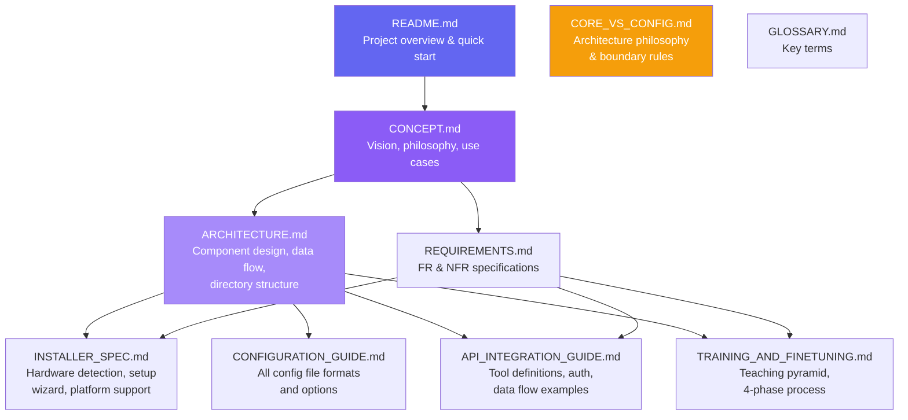

# Project Analysis: chatbot-ia-lib

This document provides an analytical overview of how the project is structured, what each piece does, and how they relate — designed to help anyone understand whether the project aligns with the original vision.

---

## Original Vision Summary

The goal is to create a **reusable AI chatbot framework** where:

1. A **Smart Installer** detects hardware and sets up the AI environment automatically
2. A **CORE engine** handles all chatbot logic (conversation flow, AI communication, tool execution) — and never changes per deployment
3. **Configuration files** (rules, tools, prompts, training data) define all business-specific behavior — these are the only things modified per project
4. The AI is **"taught"** the business through a structured process (rules → API knowledge → optional fine-tuning)
5. The system supports **local LLMs** (Ollama/Llama) and **cloud APIs** (DeepSeek) interchangeably

---

## Project Structure Analysis

### Documentation Map

### How Each Document Fits the Vision

| Document | Covers Vision Point | Status |
|:---|:---|:---|
| CONCEPT.md | Overall vision, philosophy, and use cases | ✅ Comprehensive |
| ARCHITECTURE.md | CORE engine components, data flow, tech stack | ✅ Comprehensive |
| REQUIREMENTS.md | Specific FR/NFR for each component | ✅ Comprehensive |
| INSTALLER_SPEC.md | Smart installer (Point 1) | ✅ Comprehensive |
| CONFIGURATION_GUIDE.md | Configuration files (Point 3) | ✅ Comprehensive |
| CORE_VS_CONFIG.md | CORE/Config separation (Points 2 & 3) | ✅ Comprehensive |
| API_INTEGRATION_GUIDE.md | Teaching via tools (Point 4) | ✅ Comprehensive |
| TRAINING_AND_FINETUNING.md | Teaching process (Point 4) | ✅ Comprehensive |
| GLOSSARY.md | Reference terms | ✅ Comprehensive |

---

## Component Analysis

### 1. Smart Installer Analysis

**What it solves**: Removes the barrier of AI/ML expertise for deploying a chatbot. A developer shouldn't need to know what "quantization" means to get started.

**Key design decisions**:
- Dual-mode interface: CLI (fast, headless) or Web UI (visual, guided)
- CLI-based by default for dev workflows, `--ui` flag for visual setup
- Supports 3 platforms: macOS, Linux, Windows
- Decision matrix handles GPU/CPU/RAM combinations
- User can always override recommendations
- Generates starter config files specific to use case

**Alignment with vision**: ✅ Fully aligned. The installer is the entry point that makes the library accessible to non-AI developers.

### 2. CORE Engine Analysis

**What it solves**: Provides a battle-tested conversation engine that handles the complex parts (context management, tool execution, multi-turn dialogue) so each deployment only needs to provide business-specific content.

**Components**:
- **Orchestrator** → Main loop: message → prompt → AI → response/tool → repeat
- **Session Manager** → Per-user state (history, gathered data)
- **Prompt Builder** → Assembles: system prompt + rules + tools + history + message
- **Tool Executor** → Calls business APIs when AI decides to
- **Response Formatter** → Post-processes AI output for the client

**Alignment with vision**: ✅ Fully aligned. The CORE is designed to be universal — same code regardless of business.

### 3. Configuration Layer Analysis

**What it solves**: Allows each deployment to be customized entirely through files — no code changes.

**Files and their roles**:
- `chatbot.config.json` → Infrastructure settings (backend, ports, timeouts)
- `rules.md` → Business policies in natural language
- `tools.json` → API endpoints the AI can call (declarative)
- `prompts/` → Message templates (system, welcome, fallback)
- `auth.json` → API credentials
- `training/` → Fine-tuning datasets

**Alignment with vision**: ✅ Fully aligned. This is the core innovation — separation of engine from business logic through configuration.

### 4. AI Backend Layer Analysis

**What it solves**: Abstraction over local (Ollama) and cloud (DeepSeek/OpenAI) LLMs.

**Key design decisions**:
- Unified interface for all backends
- Fallback support (local → cloud)
- No vendor lock-in: switching providers = config change

**Alignment with vision**: ✅ Fully aligned. Point 3 of the original philosophy (Local vs. Cloud Flexibility).

### 5. Teaching Process Analysis

**What it solves**: Structured approach to making the AI useful for a specific business.

**The 4 phases**:
1. **Business Rules** (immediate) → Write rules → AI follows immediately
2. **API Knowledge** (configuration) → Define tools → AI knows what it can do
3. **Fine-Tuning** (optional) → JSONL dataset → Custom model behavior
4. **Iteration** (ongoing) → Feedback → Corrections → Retrain

**Alignment with vision**: ✅ Fully aligned. This is the "teaching" process the vision describes.

---

## Relationship to ecommerce-chatbot (PoC)

The `ecommerce-chatbot` project in the portfolio is the **proof of concept** that inspired this library.

### What the PoC Demonstrated
- AI + function calling works for business chatbots
- Ollama + Llama 3.2 can run locally with good results
- The tool/function-calling pattern handles real business operations (orders, payments, tracking)
- React + Express + SQLite is a viable stack

### What This Library Generalizes

| PoC (ecommerce-chatbot) | Library (chatbot-ia-lib) |
|:---|:---|
| Hardcoded for ecommerce | Configurable for any industry |
| Tools defined in JS code | Tools defined in `tools.json` |
| Business rules in system prompt string | Business rules in `rules.md` |
| Manual Ollama setup | Smart installer with hardware detection |
| No fine-tuning support | Full training pipeline |
| No admin dashboard | Observability layer |
| Single deployment | Reusable framework |

---

## Risk & Complexity Analysis

### Low Risk
- Business rules via system prompt → Well-established pattern
- Ollama integration → Mature, well-documented API
- Configuration file approach → Classic, battle-tested pattern

### Medium Risk
- Prompt template complexity → Need to ensure templates don't become a mini-language
- Tool parameter validation → Must handle edge cases (missing optional params, type coercion)
- Context window management → Summarization is complex; sliding window is safer to start

### Higher Risk
- Local fine-tuning → GPU compatibility, training stability, model quality
- Multi-session scaling → Redis integration adds operational complexity
- Prompt injection defense → Active research area, no perfect solution

### Recommended Approach
1. **MVP**: CORE + Config + Ollama + Rules (no fine-tuning, sliding window context)
2. **V1**: Add cloud fallback, tool executor, admin dashboard
3. **V2**: Add fine-tuning pipeline, RAG for large knowledge bases
4. **V3**: Multi-tenancy, advanced security, plugin system

---

## Conclusion

The documentation thoroughly covers the original vision. Every component is designed to reinforce the central idea: **a chatbot framework where the engine stays the same and only configuration files change per deployment**. The project is well-positioned to evolve from the ecommerce-chatbot PoC into a generic, reusable library.
