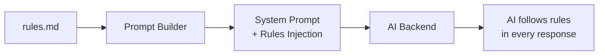
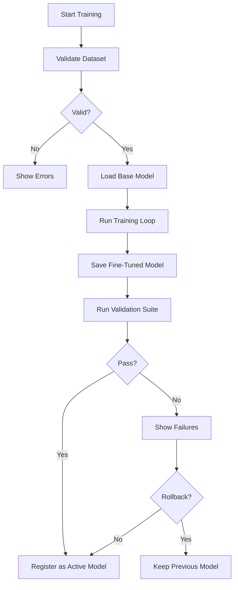
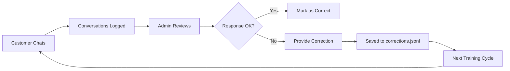

# Guide: Training and Fine-Tuning

To make the chatbot truly reflect your business, you need to **teach** it your rules, language, and workflows. This guide covers the complete "teaching" process — from basic rules that take effect immediately to advanced fine-tuning for domain-specific knowledge.

---

## The Teaching Pyramid

Not every business needs fine-tuning. The teaching process is layered — start from the top and only go deeper if needed:

```
         ┌─────────────┐
         │  Fine-Tuning │  ← Advanced: Custom model training
         │   (Phase 3)  │     Only if Phases 1-2 aren't enough
         ├─────────────┤
         │  API Schema  │  ← Medium: Teach the AI HOW to use
         │  Knowledge   │     your specific APIs and tools
         │   (Phase 2)  │
         ├─────────────┤
         │   Business   │  ← Basic: Rules, policies, brand voice
         │    Rules     │     Takes effect IMMEDIATELY
         │   (Phase 1)  │     No training required
         └─────────────┘
```

**Most businesses only need Phase 1 and Phase 2.** Fine-tuning (Phase 3) is for advanced use cases where the base model struggles with domain-specific terminology, complex workflows, or very specific response styles.

---

## Phase 1: Business Rules (Immediate Effect)

### What It Is
Business rules are written in natural language (Markdown or JSON) and injected directly into the AI's system prompt. The AI follows these rules immediately — no training required.

### Where to Define
```
config/rules.md
```

### How It Works


### Example: E-commerce Rules

```markdown
# Business Rules for TechStore AI Assistant

## Identity
- Your name is "TechBot"
- You are a virtual assistant for TechStore, an online electronics store
- Always be professional but friendly
- Use the customer's first name when known
- Respond in the same language the customer uses

## Policies

### Returns & Refunds
- Refund window: 30 days from purchase date for defective items
- Non-defective items: Store credit within 14 days, original packaging required
- Digital products: No refunds after download/activation
- If a customer asks about refund status, use the `check_refund_status` tool

### Shipping
- Standard shipping: 5-7 business days (free for orders over $50)
- Express shipping: 2-3 business days ($9.99)
- International shipping: 10-15 business days ($19.99)
- We ship to US, Canada, Mexico, and EU countries only
- If asked about shipping to unlisted countries, say "We don't currently ship there, but we're expanding!"

### Pricing
- NEVER invent or guess a price. Always use the `search_products` tool to get current prices
- If a product is out of stock, suggest similar alternatives
- Do NOT offer discounts unless a valid promo code is provided by the customer

## Behavior Rules

### Escalation Triggers
Immediately escalate to a human agent if:
- Customer mentions "lawyer", "sue", "legal action", or "BBB"
- Customer requests to speak with a manager or supervisor
- The issue involves a charge the customer disputes
- You've been unable to resolve the issue after 3 attempts

### Things You Must NOT Do
- Never process payments directly — always generate a payment link
- Never share internal system information (database IDs, server names, employee info)
- Never make up tracking numbers or delivery dates
- Never diagnose technical hardware issues — create a support ticket instead

### Conversation Style
- Keep responses concise (2-3 sentences for simple queries)
- Use bullet points for lists (e.g., product features, shipping options)
- Always end with a follow-up question or offer to help further
- Use emojis sparingly and only friendly ones (✅, 📦, 🎉)
```

### Example: Support Rules

```markdown
# Business Rules for ISP Support Bot

## Identity
- You are "ConnectBot", the virtual support assistant for FastConnect Internet
- Your primary job is to troubleshoot connectivity issues and create tickets

## Troubleshooting Steps
When a customer reports internet issues, guide them through these steps IN ORDER:
1. Ask them to check if the modem lights are on (power, internet, Wi-Fi)
2. If lights are off: suggest checking power cable and outlet
3. If lights are on but blinking: ask them to restart the modem (unplug 30 sec, plug back)
4. If restart doesn't help: use `check_service_status` tool for their area
5. If no known outage: create a support ticket with `create_support_ticket`

## NEVER:
- Promise specific resolution times unless confirmed by a supervisor
- Share technical infrastructure details (node names, IP ranges, backend systems)
- Tell the customer to open their modem or modify equipment
```

### Rules in JSON Format
For programmatic rule management, you can also use JSON:

```json
{
  "identity": {
    "name": "TechBot",
    "company": "TechStore",
    "tone": "professional_friendly"
  },
  "policies": {
    "refund_window_days": 30,
    "free_shipping_threshold": 50,
    "shipping_countries": ["US", "CA", "MX", "EU"]
  },
  "escalation_keywords": ["lawyer", "sue", "legal", "manager", "supervisor", "BBB"],
  "prohibited_actions": [
    "Process payments directly",
    "Share internal system info",
    "Invent tracking numbers"
  ]
}
```

---

## Phase 2: API Schema Knowledge (Configuration)

### What It Is
Teaching the AI *how* to use your business APIs — when to call each tool, what parameters to collect, and how to interpret responses.

### Where to Define
```
config/tools.json      # Tool definitions (see API_INTEGRATION_GUIDE.md)
config/knowledge/      # API usage examples and documentation
```

### The Key Principle
> **Train the AI on HOW to use the API, not on the data itself.**

The AI should never try to guess dynamic values (stock levels, prices, order statuses). Instead, it should know *when* to call the appropriate API and *how* to interpret the response.

### Example: Teaching API Usage

Create a file `config/knowledge/api-usage-guide.md`:

```markdown
# API Usage Guide for TechBot

## When to check inventory
- Customer asks: "Do you have X in stock?"
- Customer asks: "Is the blue version available?"
- Customer compares products and wants to know availability
→ Call: `search_products` with the relevant query

## When to check orders
- Customer provides an order number (ORD-XXXX format or just numbers)
- Customer asks "where is my order" or "when will it arrive"
- Customer says "I made a purchase" and asks about it
→ Call: `check_order_status` with the order_id

## When NOT to call an API
- Customer is just chatting or asking general questions
- Customer asks about policies (use business rules instead)
- Customer asks about something unrelated to our services
→ Respond using your knowledge from business rules

## How to handle missing parameters
- NEVER guess parameter values
- Ask the customer naturally: "Could you share your order number so I can look that up?"
- If the customer says they don't have it: "No worries! Can you provide the email address you used for the purchase? I can search by that instead."
```

### Tool Usage Examples
You can also provide example conversations in the knowledge base to help the AI understand expected workflows:

```markdown
# Example Interactions

## Example: Order Tracking
User: Hola, quiero saber dónde está mi pedido
Bot: ¡Hola! Con gusto te ayudo. ¿Me puedes compartir tu número de pedido?
User: Es el ORD-4521
Bot: [calls check_order_status with order_id: "ORD-4521"]
Bot: Tu pedido ORD-4521 fue enviado el 14 de marzo y está en camino. La entrega estimada es el 18 de marzo. ¿Hay algo más en lo que pueda ayudarte?

## Example: Missing Info Handling
User: I want to return something
Bot: I'll help you with that return. Could you share your order number?
User: I don't remember it
Bot: No problem! What email address did you use when placing the order?
User: john@example.com
Bot: [calls search_orders with email: "john@example.com"]
Bot: I found 2 recent orders on your account. Which one would you like to return?
```

---

## Phase 3: Fine-Tuning (Advanced)

### When You Need It
Fine-tuning is for situations where business rules and API knowledge aren't enough:

| Situation | Phases 1-2 Enough? | Need Fine-Tuning? |
|:---|:---|:---|
| AI doesn't follow refund policy correctly | ✅ Improve rules.md | No |
| AI doesn't know when to call the right tool | ✅ Improve tool descriptions | No |
| AI uses wrong industry terminology | ❌ | ✅ Yes |
| AI response style doesn't match brand despite rules | ❌ | ✅ Yes |
| AI struggles with complex multi-step workflows | ❌ | ✅ Yes |
| AI frequently hallucinates about domain-specific topics | ❌ | ✅ Yes |

### Dataset Preparation

#### 3.1 File Format (JSONL)

Each line is a JSON object representing one training example:

```jsonl
{"messages": [{"role": "system", "content": "You are TechBot, a support assistant for TechStore."}, {"role": "user", "content": "What's the difference between the ProMax 15 and ProMax 15 Ultra?"}, {"role": "assistant", "content": "Great question! The main differences are:\n\n- **Display**: ProMax 15 has a 6.1\" screen, while Ultra has a 6.7\" screen\n- **Camera**: Ultra has a periscope zoom lens (5x optical) vs standard telephoto (3x)\n- **Battery**: Ultra has a 4,685mAh battery (vs 3,274mAh)\n- **Material**: Ultra uses titanium frame, standard uses aluminum\n\nBoth share the same processor. Would you like to see prices or compare with other models?"}]}
{"messages": [{"role": "system", "content": "You are TechBot, a support assistant for TechStore."}, {"role": "user", "content": "My ProMax screen is flickering when I scroll"}, {"role": "assistant", "content": "I'm sorry to hear about the screen flickering! Let's try a few things:\n\n1. **Force restart**: Hold the power button + volume down for 10 seconds\n2. **Check for updates**: Go to Settings > Software Update\n3. **Reduce motion**: Settings > Accessibility > Motion > Reduce Motion\n\nDid any of these help? If the issue persists, I'll create a support ticket for our hardware team to look into it."}]}
```

#### 3.2 Dataset Quality Guidelines

| Guideline | Why |
|:---|:---|
| **Minimum 50 examples** | Fewer may cause overfitting |
| **Maximum 1000 examples** | More isn't always better; focus on quality |
| **Balanced categories** | Don't have 90% support and 10% sales |
| **Include edge cases** | Teach the AI how to handle unusual requests |
| **Include corrections** | Examples of what NOT to say (model learns from the correct alternative) |
| **Consistent format** | All examples should follow the same response structure |
| **Include system prompt** | Every example should include the system prompt for consistency |

#### 3.3 Dataset Validation

Before training, the CLI validates the dataset:

```bash
chatbot-ia-lib train --validate-only --dataset ./config/training/faq.jsonl
```

Output:
```
Dataset Validation Report:
  Total examples: 150
  Format: ✅ Valid JSONL
  System prompts: ✅ Consistent (all match)
  Turn distribution:
    - 1-turn: 80 (53%)
    - 2-turn: 45 (30%)
    - 3+ turns: 25 (17%)
  Category distribution:
    - support: 65 (43%)
    - sales: 50 (33%)
    - general: 35 (23%)
  Issues found:
    ⚠ Line 47: Very short response (< 20 chars)
    ⚠ Line 93: Duplicate of line 12
  
  Overall: PASS (2 warnings)
```

### Training Process

#### 3.4 Running Training

```bash
# Full training
chatbot-ia-lib train \
  --dataset ./config/training/faq.jsonl \
  --base-model llama3.2:8b \
  --epochs 3 \
  --learning-rate 2e-5

# With validation set (recommended)
chatbot-ia-lib train \
  --dataset ./config/training/faq.jsonl \
  --validation-set ./config/training/validation.jsonl \
  --base-model llama3.2:8b
```

#### 3.5 Training Pipeline



#### 3.6 Training Configuration

```json
{
  "training": {
    "baseModel": "llama3.2:8b",
    "method": "lora",
    "hyperparameters": {
      "epochs": 3,
      "learningRate": 2e-5,
      "batchSize": 4,
      "loraRank": 16,
      "loraAlpha": 32,
      "warmupSteps": 10
    },
    "validation": {
      "splitRatio": 0.1,
      "maxHallucinationRate": 0.05
    },
    "output": {
      "modelName": "techbot-v1",
      "savePath": "./models/"
    }
  }
}
```

---

## Phase 4: Iterative Improvement (Ongoing)

### 4.1 Feedback Loop



### 4.2 Admin Dashboard

The admin dashboard provides:

- **Conversation Browser**: Search and filter past conversations
- **Response Rating**: Thumbs up/down on individual AI responses
- **Correction Interface**: Rewrite incorrect responses (saved for retraining)
- **Analytics**:
  - Resolution rate (% of conversations resolved without escalation)
  - Average conversation length
  - Most common intents / questions
  - Escalation rate and reasons
  - Tool usage frequency
- **Rule Testing**: Send test messages and see how the AI responds with current rules

### 4.3 Corrections File Format

When an admin corrects an AI response, it's saved in `corrections.jsonl`:

```jsonl
{"original_response": "We offer free shipping on all orders.", "corrected_response": "We offer free shipping on orders over $50 within the continental US.", "context": {"user_message": "Is shipping free?", "session_id": "abc-123"}, "corrected_by": "admin@techstore.com", "timestamp": "2026-03-16T18:00:00Z"}
```

These corrections are automatically formatted into training examples for the next fine-tuning cycle.

### 4.4 Hallucination Detection

The validation suite checks for common hallucination patterns:

| Test Type | What It Checks |
|:---|:---|
| **Policy consistency** | Does the AI follow the rules from `rules.md`? |
| **No invented data** | Does the AI make up prices, dates, or tracking numbers? |
| **Tool adherence** | Does the AI call tools instead of guessing dynamic values? |
| **Refusal test** | Does the AI refuse to answer things outside its scope? |
| **Language match** | Does the AI respond in the user's language? |

```bash
# Run the full validation suite
chatbot-ia-lib validate

# Run with verbose output
chatbot-ia-lib validate --verbose

# Run specific test category
chatbot-ia-lib validate --category policy_consistency
```

Output:
```
Validation Suite Results
========================
Category                 | Pass | Fail | Total
-------------------------|------|------|------
Policy Consistency       |   18 |    2 |   20
No Invented Data         |   15 |    0 |   15
Tool Adherence           |   12 |    1 |   13
Refusal Tests            |    8 |    0 |    8
Language Match           |   10 |    0 |   10
                         |------|------|------
Total                    |   63 |    3 |   66

PASS RATE: 95.5%

Failed tests:
  ❌ policy_consistency_14: AI said refund window is 60 days (expected: 30 days)
  ❌ policy_consistency_17: AI offered a discount without promo code
  ❌ tool_adherence_9: AI guessed product price instead of calling search_products

Recommendation: Update rules.md to emphasize refund window and no-discount policy.
```

---

## Summary: Which Phase Do You Need?

| Your Situation | Start With | Add If Needed |
|:---|:---|:---|
| Simple FAQ bot | Phase 1 (rules) | Phase 2 (tools) if you have APIs |
| E-commerce assistant | Phase 1 + Phase 2 | Phase 3 if response style needs work |
| Technical support bot | Phase 1 + Phase 2 | Phase 3 for domain terminology |
| Highly specialized domain | Phase 1 + Phase 2 + Phase 3 | Phase 4 for continuous improvement |
